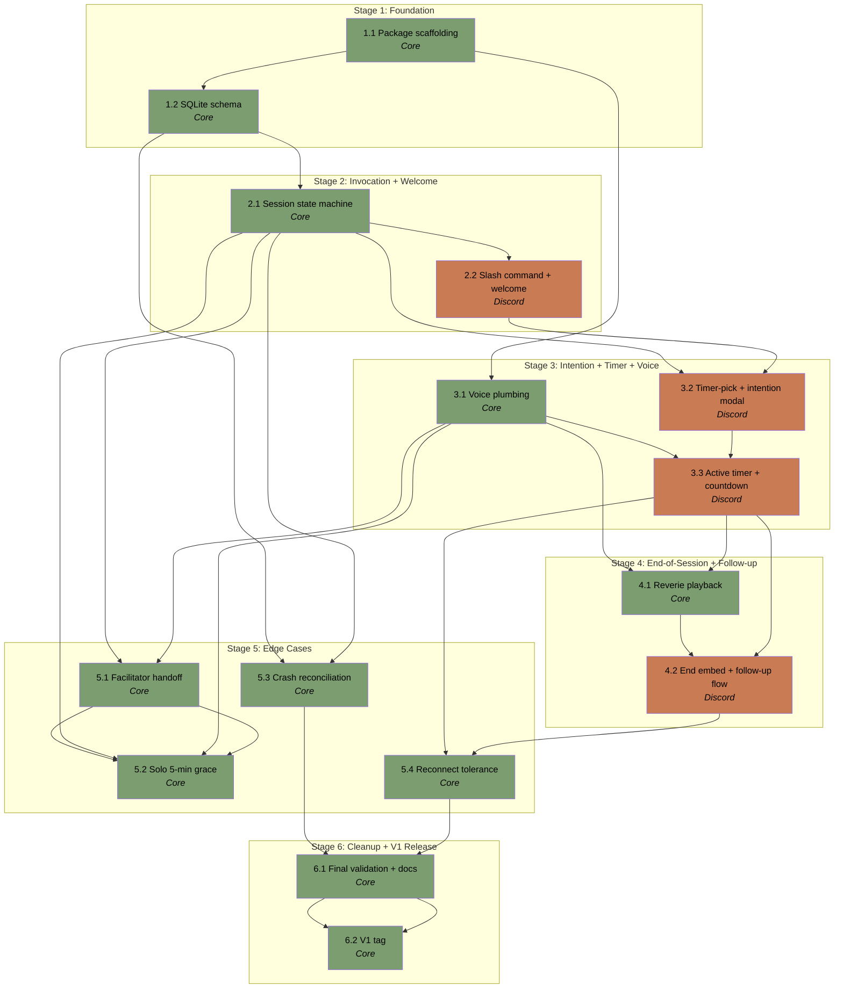

# APM Plan

## Workers

| Worker Group | Domain | Description |
|---|---|---|
| Core | Domain logic — session state machine, persistence, voice plumbing, edge cases | Owns `teamode/session.py`, `teamode/db.py`, `teamode/voice.py`, `teamode/config.py`, and tests for those modules. |
| Discord | Discord-facing layer — slash command, interaction handlers, embeds, button rows, modals, message edit cycle | Owns `teamode.py`, `teamode/bot.py`, and tests for the bot module. |

## Stages

| Stage | Name | Tasks | Groups |
|---|---|---|---|
| 1 | Foundation | 2 | Core |
| 2 | Invocation + Welcome | 2 | Core, Discord |
| 3 | Intention + Timer + Voice | 3 | Core, Discord |
| 4 | End-of-Session + Follow-up | 2 | Core, Discord |
| 5 | Edge Cases | 4 | Core |
| 6 | Cleanup + V1 Release | 2 | Core |

Total: **15 Tasks** across 6 Stages, distributed Core: 11, Discord: 4.

## Dependency Graph

---

> **Notes:**
> - Workload is skewed toward Core (10 of 13 tasks). This matches the
>   architecture — most logic is Discord-agnostic. Stage 5 is the
>   biggest Core batch opportunity: T5.1 → T5.2 share the voice-state
>   listener seam and chain naturally; T5.3 and T5.4 are independent
>   and can pair.
> - Within each stage 2–4, the Core task precedes the Discord task —
>   Discord builds on Core. Sequential dispatch is the natural shape;
>   no parallelism across the seam within those stages.
> - **Holistic verification points** the Manager should consider:
>   - End of Stage 2: a real Discord smoke test (slash command +
>     welcome embed + guard refusal) before moving on.
>   - End of Stage 3: a 10-minute end-to-end session minus reverie —
>     intention captured, voice connected, timer ticks correctly.
>   - End of Stage 4: the full happy path including reverie. UAT
>     walkthrough per `.project-meta/.LLMAO/uat-verification.md`.
>   - End of Stage 5: each edge case verified individually if a tester
>     is available; otherwise mark DEFERRED for V1 monitoring per
>     `.project-meta/conventions.md` § "Monitoring section in the
>     backlog."
>   - End of Stage 6: full UAT before tag.
> - **Approval gates apply throughout** per AGENTS.md APM_RULES —
>   before any file edit and before any commit. Smoke-test commands
>   are required for any user-facing change per
>   `.project-meta/conventions.md` § "Smoke Test Delivery."
> - **Critical path**: T1.1 → T1.2 → T2.1 → T2.2 → T3.2 → T3.3 →
>   T4.2 → T5.4 → T6.1 → T6.2. Voice tasks (T3.1, T4.1) and edge
>   cases (T5.1–T5.3) are off the critical path and could parallelize
>   conceptually, but the single-author dispatch model means they go
>   in their natural slot.
> - **`pip-audit` is blocking** for Stage 6 per
>   `.project-meta/conventions.md` § "Dependency Maintenance." High
>   or critical findings block the V1 tag.
> - **Token security**: `DISCORD_BOT_TOKEN` must come from env vars or
>   `.env` (gitignored); never committed. Tasks 1.1, 2.2, 3.1, and
>   any smoke test must respect this.

## Stage 1: Foundation

### Task 1.1: Package scaffolding + env loader - Core

* **Objective:** Create the Python package skeleton, dependency manifest, and environment-variable loader.
* **Output:** `teamode/__init__.py`, `teamode.py` entry stub, `teamode/config.py`, `requirements.txt`, `.env.example`, `tests/__init__.py`, `tests/test_config.py`.
* **Validation:** Package imports without error. `python3 -c "from teamode import config"` succeeds. `pyright` and `ruff check` clean. `tests/test_config.py` covers happy path and missing-token error.
* **Guidance:** Follow the layout in `AGENTS.md` § "Project Structure & Module Organization." Pin `discord.py[voice]`, `python-dotenv`, `pytest`, `pytest-asyncio`, `ruff`, `pyright` exactly per `.project-meta/conventions.md` § "Dependency Maintenance." `config.py` reads `DISCORD_BOT_TOKEN` (required, raise on missing) and `TEAMODE_DB_PATH` (default `./sessions.db`). `.env.example` carries stub values; never commit a real `.env` (already in `.gitignore`).
* **Dependencies:** None.

1. Create `teamode/__init__.py`, `teamode.py` entry stub, `tests/__init__.py`.
2. Write `requirements.txt` pinning all dependencies to exact versions.
3. Implement `teamode/config.py` with env loading and clear error on missing required values.
4. Add `.env.example` with stub values.
5. Write `tests/test_config.py` covering "loads correctly" and "raises on missing token."
6. Run `ruff format`, `ruff check`, `.venv/bin/python -m pytest tests/`, `pyright`. Report results.

### Task 1.2: SQLite schema + db helpers - Core

* **Objective:** Implement the SQLite schema, idempotent init, and write helpers for every state transition.
* **Output:** `teamode/db.py`, `tests/test_db.py`.
* **Validation:** `tests/test_db.py` exercises every write helper against `:memory:` and asserts schema columns match `docs/sqlite-schema.md` exactly. All validation gates clean.
* **Guidance:** Schema authoritative source: `docs/sqlite-schema.md`. Use `CREATE TABLE IF NOT EXISTS` for idempotent init at startup. Cover every operation listed in the Spec § "Persistence — Write discipline" table: `insert_pending_session`, `update_duration`, `update_intention_and_status`, `update_started_at_active`, `update_to_followup`, `update_completed`, `update_followup_timeout`, `update_handoff_facilitator`, `update_cancelled`, `reconcile_crashed_sessions`. Use `sqlite3` stdlib synchronously inside coroutines per `.project-meta/conventions.md` § "TeaMode — Project-Specific" / "SQLite write discipline." No mocks for SQLite — exercise the real path with `:memory:` per `.project-meta/.LLMAO/test-patterns.md`.
* **Dependencies:** Task 1.1.

1. Implement `teamode/db.py` with `init_db(path)`, write helpers, and `reconcile_crashed_sessions()`.
2. Write `tests/test_db.py` exercising schema init, every write helper, and reconciliation against `:memory:`.
3. Run validation pipeline.

## Stage 2: Invocation + Welcome

### Task 2.1: Session state machine + in-memory registry - Core

* **Objective:** Implement the session state machine and the in-memory `SessionRegistry` keyed by `session_id`.
* **Output:** `teamode/session.py`, `tests/test_session.py`.
* **Validation:** Tests cover every state transition, refusal paths (transition from invalid prior state), and parallel-channel sessions (two sessions in different channels do not collide). All validation gates clean.
* **Guidance:** Implement per Spec § "Session Lifecycle." States are an enum (`SessionState.PENDING`, `INTENTION_SET`, `ACTIVE`, `FOLLOWUP`, `COMPLETED`, `FOLLOWUP_TIMEOUT`, `CANCELLED`, `CRASHED`). `Session` dataclass holds session id, channel ids, facilitator id, state, intention, etc. Transition functions both update in-memory state and write the SQLite row using helpers from Task 1.2. The `SessionRegistry` (a dict keyed by `session_id` plus a reverse index by `text_channel_id`) is the source of truth for "is there an active session in channel X?" lookups; SQLite is the durable redundant truth used at startup. Cross-session safety: every transition reads the registry and confirms the session is in a valid prior state; raises otherwise.
* **Dependencies:** Task 1.2.

1. Define `SessionState` enum and `Session` dataclass.
2. Implement `SessionRegistry` with by-id and by-text-channel lookups.
3. Implement transition functions: `create_pending_session`, `set_duration`, `set_intention`, `mark_active`, `mark_followup`, `mark_completed`, `mark_followup_timeout`, `mark_handoff`, `mark_cancelled`. Each writes both in-memory and SQLite per Spec.
4. Write `tests/test_session.py` covering happy-path transitions, all refusal paths, and parallel-channel safety.
5. Run validation pipeline.

### Task 2.2: Slash command + invocation guard + welcome embed - Discord

* **Objective:** Register `/teamode`, implement the cumulative invocation guard, and post the welcome embed with the timer-pick button row on guard pass.
* **Output:** `teamode/bot.py`, `teamode.py` entry wired, `tests/test_bot_invocation.py`.
* **Validation:** Unit tests with `FakeInteraction` cover each guard branch (pass, wrong-channel, not-in-voice, session-already-active). Refusal messages match Spec verbatim. Manual Discord smoke test confirms slash command registers in the dev guild and welcome embed renders with the matcha-sage accent.
* **Guidance:** Register `/teamode` guild-scoped per Spec § "Bot Identity and Invocation." Guard checks per Spec § "Invocation guard (cumulative)" — order matters: channel type, in-voice, no-active-session. Refusal messages are ephemeral with muted-grey accent per Spec § "Invocation guard" failure table. Welcome embed uses matcha sage `#7B9D6F`, the 🍵 + ⏳ pair, and the welcome copy from Spec § "Session Lifecycle — Sequence of bot actions." Timer-pick button row uses custom_id namespace `teamode:<session_id>:timer:<10|25|50>` per `.project-meta/UI-ADR.md` § "Custom_id namespace." On guard pass, call `session.create_pending_session(...)` from Task 2.1 and post the welcome embed with buttons attached. **Do not** handle the button-click yet — Task 3.2.
* **Dependencies:** Task 2.1.

1. Implement `teamode/bot.py` with `discord.Client` + `app_commands.CommandTree` and register `/teamode`.
2. Implement the cumulative guard logic; emit ephemeral refusals with the muted-grey accent.
3. On guard pass, call `session.create_pending_session(...)`, then post the welcome embed + timer-pick button row using the custom_id namespace.
4. Wire `teamode.py` entry point: load config, construct bot, run event loop. Call `db.init_db(...)` and `db.reconcile_crashed_sessions(...)` at startup.
5. Write `tests/test_bot_invocation.py` covering each guard branch with `FakeInteraction` per `.project-meta/.LLMAO/test-patterns.md`.
6. Run validation pipeline. Deliver paste-ready smoke-test command per `.project-meta/conventions.md` § "Smoke Test Delivery": `cd ~/WSL/github.com/jonathan-fang/teamode && source .venv/bin/activate && DISCORD_BOT_TOKEN=... python3 teamode.py` plus the in-Discord steps.

## Stage 3: Intention + Timer + Voice

### Task 3.1: Voice connection plumbing - Core

* **Objective:** Implement the voice connection helpers (connect, play_reverie, disconnect) with the asset path constant.
* **Output:** `teamode/voice.py`, `tests/test_voice.py`.
* **Validation:** Tests mock `voice_client.play` and assert it was called with the correct `FFmpegPCMAudio` source path. Smoke test confirms reverie audibly plays in a real voice channel. All validation gates clean.
* **Guidance:** Implement `teamode/voice.py` with `connect(voice_channel) -> VoiceClient`, `play_reverie(voice_client)`, `disconnect(voice_client)`. Constant: `REVERIE_PATH = Path(__file__).parent / ".." / "assets" / "reverie.wav"` resolved once at import per Spec § "Voice — Asset path." Use `discord.FFmpegPCMAudio(str(REVERIE_PATH))`. On `play()` raising, propagate — the Discord layer (Task 4.1 / 4.2) handles the @-mention fallback. On `connect()` raising, propagate — the slash-command flow surfaces an ephemeral refusal. Mock `voice_client.play` in tests; do not shell out to `ffmpeg`.
* **Dependencies:** Task 1.1.

1. Implement `teamode/voice.py` with the three helpers and the `REVERIE_PATH` constant.
2. Write `tests/test_voice.py` mocking `voice_client.play`. Verify `FFmpegPCMAudio` is constructed with the resolved reverie path.
3. Run validation pipeline. Deliver voice-smoke-test command (manual: bot joins voice, plays reverie via a temporary admin trigger if needed).

### Task 3.2: Timer-pick handler + intention modal + participant prompt - Discord

* **Objective:** Implement the timer-pick button click handler (facilitator-only), the intention modal, and the post-intention participant prompt.
* **Output:** `teamode/bot.py` extended with timer-pick handler + Modal subclass; `tests/test_bot_intention.py`.
* **Validation:** Tests cover facilitator-click and non-facilitator-click branches; modal submission unit-tested with a faked Modal interaction; participant prompt content matches Spec verbatim. Smoke test confirms the modal opens for the facilitator and submission publishes the intention.
* **Guidance:** Timer-pick button click handler dispatches on the custom_id pattern from Task 2.2. Facilitator-only authorization per Spec § "Authorization" — non-facilitator clicks get the standard ephemeral refusal "Only the facilitator can answer." On facilitator click: call `session.set_duration(...)`, then open the intention `Modal` (single text input, max 4000 chars per Spec § "Persistence" / Discord limit). On modal submit: call `session.set_intention(...)`. Post the participant intention prompt as a plain text message in the channel: "Everyone — type your intention in chat or share it in voice. Take a minute." per Spec § "Participant flow."
* **Dependencies:** Task 2.1, Task 2.2.

1. Add timer-pick button click handler in `teamode/bot.py` dispatching on `teamode:<session_id>:timer:<value>`.
2. Define the intention `Modal` subclass with one `TextInput`.
3. Wire facilitator authorization: non-facilitator clicks receive ephemeral refusal.
4. Wire modal submission to `session.set_intention(...)` then post the participant intention prompt.
5. Write `tests/test_bot_intention.py` covering both click paths and modal submission.
6. Run validation pipeline. Deliver smoke-test steps.

### Task 3.3: Active timer message + countdown loop + edit cycle - Discord

* **Objective:** After intention is set, connect to voice, post the active timer message, and run the countdown loop with the 10s edit cycle and rate-limit handling.
* **Output:** `teamode/session.py` countdown coroutine; `teamode/bot.py` edit-cycle implementation; `tests/test_session_countdown.py`.
* **Validation:** Fake-clock test runs a short countdown end-to-end and asserts edit cadence is 10s. Smoke test runs a 10-minute session and confirms the timer ticks correctly with intention echoed.
* **Guidance:** After `session.set_intention(...)` returns in Task 3.2's flow, the bot calls `voice.connect(voice_channel)` (Task 3.1), then `session.mark_active(...)` (writes `started_at`, status='active'), then posts the active timer message and starts the countdown coroutine. The countdown coroutine lives in `session.py` parameterised by a tick callback registered from `bot.py`. Tick interval: 1s internally (for state-machine fidelity); the message edit fires only every **10s** per Spec § "UI Surface — Edit cadence rules." On `discord.HTTPException` 429: exponential backoff with floor of 10s. Skip an edit if the previous one is still in flight. Active timer message format per Spec § "Visual fidelity tier (MVP)": `🍵 Intention: <…>  ⏳ <mm>:<ss>`. While `status='active'`, in-channel `/teamode` re-invocations are refused via the existing guard (Task 2.1's registry check) — verify this works end-to-end.
* **Dependencies:** Task 3.1, Task 3.2.

1. Add the countdown coroutine to `session.py` parameterised by a tick callback. Use injectable clock for testability.
2. In `bot.py`, register the tick callback that edits the active timer message.
3. Implement edit-skip-if-in-flight (e.g. an `asyncio.Event` per session) and 429 backoff.
4. Wire post-intention flow: voice connect → mark_active → post timer message → start countdown.
5. Write `tests/test_session_countdown.py` using an injected clock to verify cadence (one edit per 10 ticks).
6. Run validation pipeline. Deliver 10-minute smoke test.

## Stage 4: End-of-Session + Follow-up

### Task 4.1: Reverie playback at zero + voice disconnect - Core

* **Objective:** When the countdown reaches zero, play reverie and disconnect from voice; surface playback failure for the @-mention fallback.
* **Output:** `teamode/voice.py` extended with `play_reverie_then_disconnect()`; `tests/test_voice.py` extended.
* **Validation:** Tests cover the playback-success path (play called, then disconnect called), and the playback-failure path (play raises, exception propagates, disconnect still called). Smoke test confirms reverie audibly plays in a real session at zero.
* **Guidance:** Add `play_reverie_then_disconnect(voice_client) -> bool` returning `True` if playback succeeded, `False` if it raised (the bool drives the @-mention fallback decision in Task 4.2). Disconnect happens regardless of play success — bot doesn't camp in voice after the timer. Use `voice_client.play(audio, after=callback)` to wait for playback completion before disconnecting; an `asyncio.Event` set in the `after` callback is the conventional pattern.
* **Dependencies:** Task 3.1, Task 3.3.

1. Implement `play_reverie_then_disconnect()` in `voice.py` with the success-bool return.
2. Extend `tests/test_voice.py` for both paths.
3. Run validation pipeline. Deliver voice smoke test.

### Task 4.2: End-of-session embed + follow-up flow + participant prompt + reactions + timeout - Discord

* **Objective:** At zero, post the end-of-session embed, participant follow-up prompt, trigger reverie, @-mention facilitator, post the follow-up button row, accept reactions, handle Y/N answers (with optional "why"), 3-minute timeout, and "end early" button.
* **Output:** `teamode/bot.py` extended; `tests/test_bot_followup.py`.
* **Validation:** Tests cover Y / N (with "why" modal) / 3-min timeout / end-early branches. Participant follow-up prompt content matches Spec. Reaction handler logs reactions but does not affect `completed_intention`. Full end-to-end smoke test confirms happy path.
* **Guidance:** At countdown zero, sequence per Spec § "Session Lifecycle — Sequence of bot actions": (1) post end-of-session embed (steeping forest `#3F5E4A` accent, 🍵🌿✨ flourish); (2) post participant follow-up prompt: "Everyone — share how the session went, in chat or voice." per Spec § "Participant flow"; (3) trigger `voice.play_reverie_then_disconnect()` from Task 4.1 — if it returns False, post a fallback @-mention text "Time's up, @Facilitator!" to leverage Discord notifications; (4) post the @-mention regardless (notification trigger); (5) post the follow-up button row with two buttons: `[Yes]` and `[No]`, plus an `[End Early]` button (facilitator only). Reactions: the message accepts 👍/👎 reactions from anyone; a reaction handler logs them via console only — they do not affect state. Y click: `session.mark_completed(...)` with `completed_intention=True`. N click: open a follow-up `Modal` for the "why" text; on submit, `session.mark_completed(...)` with `completed_intention=False, followup_note=<text>`. End Early click (facilitator only, ephemeral refusal otherwise): close the window without recording an answer — `session.mark_completed(...)` with `completed_intention=NULL`. 3-minute timeout watchdog: if no facilitator action in 3 minutes, `session.mark_followup_timeout(...)`. All terminal transitions write `ended_at` per Spec.
* **Dependencies:** Task 4.1, Task 3.3.

1. Implement the end-of-session embed + participant follow-up prompt + reverie trigger + @-mention sequence.
2. Implement the follow-up button row (Y / N / End Early) with facilitator-only authorization on each.
3. Implement the "why" Modal triggered by N.
4. Implement the 3-minute timeout watchdog as a cancellable `asyncio.Task`.
5. Implement the reaction handler that logs but does not write state.
6. Wire the voice fallback @-mention when `play_reverie_then_disconnect()` returns False.
7. Write `tests/test_bot_followup.py` covering all four termination paths plus the reaction-logged-not-stored path.
8. Run validation pipeline. Deliver full-session smoke test.

## Stage 5: Edge Cases

### Task 5.1: Facilitator handoff (RNG selection) - Core

* **Objective:** When the facilitator leaves voice with ≥1 other voice member remaining, select a new facilitator via `random.choice` and announce.
* **Output:** Voice-state-update listener wired in `bot.py`; handoff logic in `session.py`; announcement message; `tests/test_session_handoff.py`.
* **Validation:** Test simulates `voice_state_update` with the facilitator leaving and asserts (a) a new facilitator is selected from remaining voice members via RNG, (b) `handoff_facilitator_id` is written to SQLite, (c) the registry's facilitator pointer updates, (d) the announcement message is posted. Optional smoke test if a tester is available — otherwise mark DEFERRED for V1 monitoring.
* **Guidance:** Register a Discord `voice_state_update` event handler in `bot.py` that dispatches into `session.py`. Detect: was the user the facilitator of an active session whose voice channel they just left? If yes and the voice channel still has ≥1 member, run `random.choice(remaining_members)` to pick the new facilitator. Update the registry, write `handoff_facilitator_id` via `db.update_handoff_facilitator(...)`, and post: "@OldFac left — @NewFac, you're now the facilitator." per Spec § "Edge Cases." Subsequent button clicks now require the new facilitator id; the registry is the source of truth.
* **Dependencies:** Task 2.1, Task 3.1.

1. Add `voice_state_update` listener in `bot.py` dispatching to `session.handle_voice_state_change(...)`.
2. Implement handoff detection + RNG selection + state mutation + DB write.
3. Post announcement message in the session's text channel.
4. Write `tests/test_session_handoff.py`.
5. Run validation pipeline.

### Task 5.2: Solo facilitator 5-minute grace - Core

* **Objective:** When the facilitator leaves voice and is solo, start a 5-minute watchdog; cancel on rejoin, terminate as `cancelled` on timeout.
* **Output:** Solo-leave detection + watchdog `asyncio.Task` in `session.py`; `tests/test_session_solo_grace.py`.
* **Validation:** Tests with injected clock cover (a) rejoin within 5 min cancels the watchdog and continues, (b) 5-min timeout terminates as `cancelled`, no reverie, message edited to "Session ended — facilitator did not return."
* **Guidance:** Extends the voice-state listener from Task 5.1. Detect: facilitator left and the voice channel is now empty (no other members). Start a 5-minute `asyncio.Task` watchdog. If facilitator rejoins the same voice channel before timeout, cancel the watchdog and continue. If 5 min elapses with the channel empty, terminate per Spec § "Edge Cases — Facilitator leaves voice, alone": edit timer message to "Session ended — facilitator did not return," play no reverie, `session.mark_cancelled(...)`, voice disconnect.
* **Dependencies:** Task 2.1, Task 3.1, Task 5.1.

1. Extend voice-state listener for solo-leave detection.
2. Implement watchdog as cancellable `asyncio.Task`.
3. Implement the termination flow.
4. Add tests with injected clock for both branches.
5. Run validation pipeline.

### Task 5.3: Crash reconciliation on startup - Core

* **Objective:** Wire `db.reconcile_crashed_sessions()` into bot startup; log the reconciled-row count.
* **Output:** `teamode.py` startup wiring; log line; `tests/test_db_reconciliation.py`.
* **Validation:** Test inserts non-terminal rows in `:memory:`, calls reconcile, asserts all are now `crashed` with `ended_at` set. Startup log line includes the count.
* **Guidance:** `reconcile_crashed_sessions()` itself was added in Task 1.2. This task wires it into the bot startup path in `teamode.py` so it runs after `init_db(...)` and before the gateway connect. Log the number of reconciled rows. Crashed rows include any with `status IN ('pending', 'intention_set', 'active', 'followup')` — all non-terminal states.
* **Dependencies:** Task 1.2, Task 2.1.

1. Wire `reconcile_crashed_sessions()` into the bot startup path in `teamode.py`.
2. Add a log line: `f"Reconciled {n} crashed sessions on startup"`.
3. Write `tests/test_db_reconciliation.py`.
4. Run validation pipeline.

### Task 5.4: Voice/gateway reconnect tolerance verification - Core

* **Objective:** Confirm that discord.py auto-reconnect handles a gateway drop without crashing the session task; document expected behavior.
* **Output:** Code comments documenting reconnect-tolerance behavior in `session.py` (countdown) and `bot.py` (event loop); smoke-test plan delivered to User.
* **Validation:** Smoke test (User runs a 10-min session, drops wifi at minute 3 for ≥30 seconds, confirms timer continues and reverie still plays at zero). No automated test required — discord.py reconnect is library behavior we don't own. If smoke test reveals an actual failure, file a follow-up before marking DEFERRED.
* **Guidance:** No code change is expected for this task — it's verification + documentation. The countdown coroutine uses `asyncio.sleep` which is unaffected by websocket state; pending edits queue via discord.py and retry. If smoke test reveals a real failure mode (e.g. countdown lock-up on extended outage), open a follow-up task; do not attempt a fix in this task.
* **Dependencies:** Task 3.3, Task 4.2.

1. Document reconnect-tolerance behavior in code comments where relevant.
2. Compose a smoke-test plan: "Run a 10-min session. At minute 3, disable wifi for 30s, then re-enable. Expected: timer continues; at zero, reverie plays."
3. Run validation pipeline (no new automated tests). Deliver smoke-test plan to User.

## Stage 6: Cleanup + V1 Release

### Task 6.1: Final validation + docs sync - Core

* **Objective:** Sync README and changelog with what shipped, run full validation pipeline, run `pip-audit`, fix any high/critical findings.
* **Output:** Updated `README.md` (remove "planned" tags), new or updated `changelog.md`, validated dependencies.
* **Validation:** All blocking checks pass clean. `pip-audit` returns no high/critical findings. User reviews and approves the README diff.
* **Guidance:** Per `.project-meta/conventions.md` § "Release Process" pre-release checklist. Update README "Status" section to remove "planned" tags now that those parts are built. Update or create `changelog.md` per `.project-meta/conventions.md` § "Documentation — Changelogs" — feature-level, user-facing language. Audit `docs/` for accuracy. Run `pip-audit -r requirements.txt`; fix high/critical findings only. **Feature freeze applies** per Spec § "Validation Approach" — no new features in this stage.
* **Dependencies:** Task 5.3, Task 5.4 (and transitively all earlier tasks).

1. Update `README.md` to reflect shipped surface — remove `_planned_` tags.
2. Create or update `changelog.md` with V1 feature list.
3. Audit `docs/` files; remove or update stale content.
4. Run `pip-audit -r requirements.txt`; remediate high/critical findings if any.
5. Run full validation pipeline.
6. Present README and changelog diffs for User approval.

### Task 6.2: V1 tag - Core

* **Objective:** Tag V1 on `main` after Task 6.1 completes clean.
* **Output:** Annotated git tag (e.g. `v26Q2.0.0`); pushed to origin per `.project-meta/conventions.md` § "Release Process — Remote push."
* **Validation:** Tag exists locally and remotely; `git status` clean; `git log` shows the cleanup commit immediately under the tag.
* **Guidance:** Per `.project-meta/conventions.md` § "Release Process." Tag format: `v26Q2.0.0` (or current quarter). Compose annotated tag message summarizing V1 deliverables. **User approval required** before tagging and before pushing.
* **Dependencies:** Task 6.1.

1. Compose tag message summarizing V1.
2. Present `git tag -a` and `git push origin <tag>` commands for User approval.
3. Tag and push after approval.
