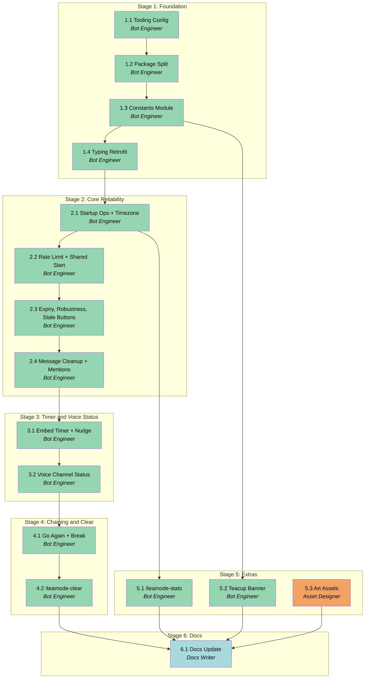

# APM Plan

## Workers

| Worker Group | Domain | Description |
|---|---|---|
| Bot Engineer | Python / discord.py runtime code and tests | Package split, constants, typing and tooling config, and every runtime feature in `app/` and `teamode.py`, with pytest coverage using the repo's fakes. |
| Asset Designer | Generated image assets | Pillow script in `scripts/` producing icon, banner and avatar PNGs in `assets/` for User review. |
| Docs Writer | Project documentation | README, UI-ADR, conventions, schema doc, AGENTS.md, changelog, TODO.md and `.env.example` aligned with shipped behavior. |

## Stages

| Stage | Name | Tasks | Groups |
|---|---|---|---|
| 1 | Foundation: Tooling, Package Split, Constants, Typing | 4 | Bot Engineer |
| 2 | Core Reliability and Session Behavior | 4 | Bot Engineer |
| 3 | Embed Timer and Voice Channel Status | 2 | Bot Engineer |
| 4 | Chained Sessions, Breaks and Channel Clear | 2 | Bot Engineer |
| 5 | Extras: Stats, Teacup Banner, Art Assets | 3 | Bot Engineer, Asset Designer |
| 6 | Documentation and Release Prep | 1 | Docs Writer |

## Dependency Graph

```mermaid
graph TB

subgraph S1["Stage 1: Foundation"]
  direction LR
  T1_1["1.1 Tooling Config<br/><i>Bot Engineer</i>"] --> T1_2["1.2 Package Split<br/><i>Bot Engineer</i>"]
  T1_2 --> T1_3["1.3 Constants Module<br/><i>Bot Engineer</i>"]
  T1_3 --> T1_4["1.4 Typing Retrofit<br/><i>Bot Engineer</i>"]
end

subgraph S2["Stage 2: Core Reliability"]
  direction LR
  T2_1["2.1 Startup Ops + Timezone<br/><i>Bot Engineer</i>"] --> T2_2["2.2 Rate Limit + Shared Start<br/><i>Bot Engineer</i>"]
  T2_2 --> T2_3["2.3 Expiry, Robustness, Stale Buttons<br/><i>Bot Engineer</i>"]
  T2_3 --> T2_4["2.4 Message Cleanup + Mentions<br/><i>Bot Engineer</i>"]
end

subgraph S3["Stage 3: Timer and Voice Status"]
  direction LR
  T3_1["3.1 Embed Timer + Nudge<br/><i>Bot Engineer</i>"] --> T3_2["3.2 Voice Channel Status<br/><i>Bot Engineer</i>"]
end

subgraph S4["Stage 4: Chaining and Clear"]
  direction LR
  T4_1["4.1 Go Again + Break<br/><i>Bot Engineer</i>"] --> T4_2["4.2 /teamode-clear<br/><i>Bot Engineer</i>"]
end

subgraph S5["Stage 5: Extras"]
  direction LR
  T5_1["5.1 /teamode-stats<br/><i>Bot Engineer</i>"]
  T5_2["5.2 Teacup Banner<br/><i>Bot Engineer</i>"]
  T5_3["5.3 Art Assets<br/><i>Asset Designer</i>"]
end

subgraph S6["Stage 6: Docs"]
  direction LR
  T6_1["6.1 Docs Update<br/><i>Docs Writer</i>"]
end

T1_4 --> T2_1
T2_4 --> T3_1
T3_2 --> T4_1
T2_1 --> T5_1
T1_3 --> T5_2
T4_2 --> T6_1
T5_1 --> T6_1
T5_2 --> T6_1
T5_3 --> T6_1

style T1_1 fill:#95d5b2,color:#000
style T1_2 fill:#95d5b2,color:#000
style T1_3 fill:#95d5b2,color:#000
style T1_4 fill:#95d5b2,color:#000
style T2_1 fill:#95d5b2,color:#000
style T2_2 fill:#95d5b2,color:#000
style T2_3 fill:#95d5b2,color:#000
style T2_4 fill:#95d5b2,color:#000
style T3_1 fill:#95d5b2,color:#000
style T3_2 fill:#95d5b2,color:#000
style T4_1 fill:#95d5b2,color:#000
style T4_2 fill:#95d5b2,color:#000
style T5_1 fill:#95d5b2,color:#000
style T5_2 fill:#95d5b2,color:#000
style T5_3 fill:#f4a261,color:#000
style T6_1 fill:#a8dadc,color:#000
```

---

> **Notes:**
> - Stage order encodes the User's slip priority: core session behavior (Stages 1–3) must ship; chaining/breaks (Stage 4) slip second; stats, teacup banner and art (Stage 5) slip first. `/teamode-clear` sits in Stage 4 only because it must classify break and nudge messages; it is not in either slip group.
> - Almost all runtime work is one long Bot Engineer chain touching `app/discord_bot/`; parallel dispatch within Stages 1–4 would collide in the same files. The MVP found parallel worktrees net-negative. Same-group sequential chains (1.1–1.4, 2.1–2.4, 3.1–3.2, 4.1–4.2) are natural batch candidates, context-window permitting — 1.2 (package split of a 1038-line file) is the heaviest single Task.
> - 5.3 has no code dependencies and could run in parallel with any Bot Engineer work; it sits in Stage 5 only to honor slip priority. 5.2 is tiny and could batch with 5.1.
> - User-involved checkpoints: Discord smoke tests after 2.4, 3.1, 3.2, 4.1, 4.2 (and optionally 5.1/5.2), art review in 5.3. The 3.2 smoke test resolves an unverified Discord permission question (Manage Channels for out-of-voice status edits) that may change 3.2's implementation and requires a User decision.
> - Stage 1 is the critical path and the main regression risk: after 1.2 the full existing suite (122 tests) must still pass with only patch-path changes. A holistic check at the end of Stage 1 (bot launches and a basic session runs in Discord) would catch wiring mistakes before features pile on.
> - Stage 2 end is a natural milestone for a Discord smoke pass covering expiry, rate limits, cleanup and the PID lock together; Stage 4 end is a natural milestone for an end-to-end chained-session run.
> - The one-day target is aggressive; if time runs short, Stage 5 then Stage 4.1 are the planned cut lines, and Stage 6 should still document whatever shipped.

## Stage 1: Foundation: Tooling, Package Split, Constants, Typing

### Task 1.1: Tooling Config - Bot Engineer

* **Objective:** Configure pyright and Ruff in `pyproject.toml` so the validation pipeline runs clean with bare commands.
* **Output:** Updated `pyproject.toml` with `[tool.pyright]` and `[tool.ruff]` sections.
* **Validation:** Bare `pyright` (no flags) reports 0 errors; `ruff check app/ teamode.py tests/` and `ruff format --check app/ teamode.py tests/` pass; `.venv/bin/python -m pytest tests/` still 122 passed; `.LLMAO/scan_injection.sh .apm` passes.
* **Guidance:** Spec §Typing and Tooling defines the pyright and Ruff requirements. `pyproject.toml` currently holds only pytest settings (`asyncio_mode = "strict"`, function loop scope) — preserve them. pyright 1.1.398 and ruff 0.11.13 are pinned in `requirements.txt`. Define the `ANN` rule selection with per-file ignores for `tests/`, but do not turn `ANN` on for `app/` yet if it produces errors on existing code — Task 1.4 turns it on after the retrofit (a commented or staged config is acceptable; leave a clear note). Disable pyright reports that duplicate Ruff (unused import/variable/class/function) rather than weakening type checking.
* **Dependencies:** None

1. Read `pyproject.toml`, `requirements.txt`, and run bare `pyright` to capture the current false errors.
2. Add `[tool.pyright]` with venv settings, excludes, and overlap-disabling report settings.
3. Add `[tool.ruff]` / `[tool.ruff.lint]` config preserving current behavior, with `ANN` selection prepared and `tests/` exempt.
4. Run the full validation pipeline and confirm all checks pass.

### Task 1.2: Package Split - Bot Engineer

* **Objective:** Replace `app/bot.py` with the `app/discord_bot/` package without changing runtime behavior.
* **Output:** `app/discord_bot/__init__.py`, `client.py`, `commands.py`, `views.py`, `timer.py`, `lifecycle.py`; `app/bot.py` removed; `teamode.py` import updated; all `tests/test_bot_*.py` patch targets updated.
* **Validation:** `app/bot.py` no longer exists; `from app.discord_bot import TeaModeBot` works; all 122 existing tests pass with only import/patch-path changes (no assertion changes); full validation pipeline passes; `grep -rn "app\.bot\b\|app/bot\.py" app tests teamode.py` returns nothing.
* **Guidance:** Spec §Architecture defines the package and module responsibilities. This is a move-only refactor: no behavior, copy, or constant changes (those are Task 1.3). Key structures to place carefully: `TeaModeBot` (`app/bot.py:224`) and its per-session dicts (`_edit_states`, `_watchdog_tasks`, `_reflect_message_ids`, `_voice_clients`, `_countdown_tasks`, `_solo_grace_tasks`, :241-263); `IntentionModal` (:114) with the nested `_run_and_followup` coroutine (:198-216); `_on_countdown_tick` (:738); `_run_end_of_session` (:405); `on_raw_reaction_add` (:501); `on_voice_state_update` (:574); `_run_solo_grace` (:668); `_handle_teamode` (:835); `_handle_handoff` (:918); builders `_build_welcome_embed` (:1004), `_build_timer_view` (:1024). Handlers on the client must stay named `on_<event>` (discord.py routes `client.event` by `__name__`). Avoid circular imports: helper modules can take the bot instance as a parameter or be mixins; choose one approach and apply it consistently. Tests patch where names are used (e.g. `app.bot.voice.connect` becomes `app.discord_bot.<module>.voice.connect`; `app.bot.asyncio.sleep` / `create_task` move similarly). Test helpers like `_install_fake_client_user` (`tests/test_bot_followup.py`) and `_make_voice_interaction` (`tests/test_bot_invocation.py:50`) should keep working. Refer to the package as `app/` (the repo root is also named `teamode/`).
* **Dependencies:** Task 1.1

1. Read `app/bot.py` fully and map each function/class to its target module.
2. Create the package modules and move code, keeping behavior identical; add the `TeaModeBot` re-export in `__init__.py`.
3. Update `teamode.py`'s import.
4. Update every test patch target and import to the new module paths.
5. Delete `app/bot.py`; run the full validation pipeline and fix until clean.

### Task 1.3: Constants Module - Bot Engineer

* **Objective:** Create `app/constants.py` holding every tunable number, every Discord-facing string, and the palette, and make the bot read from it.
* **Output:** `app/constants.py`; `app/discord_bot/` modules refactored to use it; duration-pick validation against `DURATIONS_MINUTES`; new unit tests.
* **Validation:** `app/constants.py` imports neither `discord` nor `app.config` (verified by a test importing it in isolation or by grep); no Discord-facing string literals or tunable numeric literals remain in `app/discord_bot/` (spot-check via grep for quoted user-facing text and the old `_MSG_*`/`_*_SECONDS` names); a test proves a timer-pick custom_id with minutes not in `DURATIONS_MINUTES` gets the stale-button refusal and does not advance the session; all existing tests pass; full validation pipeline passes. Runtime copy and behavior are unchanged apart from the duration check.
* **Guidance:** Spec §Constants and Copy lists the tunables and palette; Spec §Canonical Copy lists all new strings — add them now as constants (verbatim, placeholders as `str.format` fields) even though features use them later, so the User has one file to edit. Existing strings to move verbatim include `_MSG_WRONG_CHANNEL`, `_MSG_NOT_IN_VOICE`, `_MSG_SESSION_ACTIVE`, `_MSG_NOT_FACILITATOR`, `_MSG_PARTICIPANT_PROMPT`, `_MSG_VOICE_CONNECT_FAILED`, `_ACTIVE_TIMER_FMT`, `_END_EMBED_TITLE`, `_END_EMBED_BODY`, the Reflect copy, the ⛔ follow-up line, `This session is no longer active.`, `Session ended — facilitator did not return.`, the handoff announcement, the `/handoff` refusals, the welcome embed copy and both slash-command descriptions. The Set Intention prompt is duplicated (`_MSG_PARTICIPANT_PROMPT` and an inline f-string near the old `bot.py:910-912`) — consolidate into one constant. Tunables currently inline: `for minutes in (5, 10, 25, 50)`, `asyncio.sleep(1.0)` before the prompt, modal `max_length=4000`. Fix the stale durations docstring and the wrong "two spaces" comment on the timer format while moving. `discord.Color` objects are built from the hex constants inside `app/discord_bot/` (constants stays discord-free). Group the file into clearly commented sections (tunables, palette, copy by surface) so the User can find things. Do not author any new runtime text beyond the canonical list; if a needed string is missing, stop and report it.
* **Dependencies:** Task 1.2

1. Inventory every string literal sent to Discord and every tunable number in `app/discord_bot/`.
2. Create `app/constants.py` with sections for tunables, palette, existing copy and new canonical copy.
3. Replace literals in `app/discord_bot/` with constant references; build `COLORS` from the hex constants.
4. Add `DURATIONS_MINUTES` validation in the timer-pick handler with a test.
5. Run the full validation pipeline and fix until clean.

### Task 1.4: Typing Retrofit - Bot Engineer

* **Objective:** Bring every function boundary in `app/` and `teamode.py` up to the type-hint rule and remove all `cast()` / `# type: ignore`.
* **Output:** Annotated functions across `app/` and `teamode.py`; all 12 cast/ignore occurrences removed; Ruff `ANN` enabled for `app/` and `teamode.py`.
* **Validation:** `grep -rn "cast(\|type: ignore" app teamode.py` returns nothing (or only escape-hatch cases with a specific error code and justification comment, each reported explicitly); `ruff check` passes with `ANN` active for `app/` and `teamode.py`; bare `pyright` 0 errors; all tests pass; full pipeline passes.
* **Guidance:** Spec §Typing and Tooling defines the rule and lists the 12 original occurrences with replacement strategies (line numbers refer to the pre-split `app/bot.py`; locate them in `app/discord_bot/` by content). Two need pyright confirmation: `interaction.data.get("custom_id")` (narrow the data dict and `isinstance(..., str)`), and `voice_channel.connect()` (try `cls=discord.VoiceClient`, else `isinstance` guard). For `duration_minutes` possibly `None` before countdown, add an explicit guard that logs and aborts cleanly rather than asserting. Behavior must not change except where a guard handles a previously impossible state. Annotate locals only where they add information.
* **Dependencies:** Task 1.3

1. Enable `ANN` for `app/` and `teamode.py` and list the violations.
2. Add parameter and return annotations to every flagged function.
3. Replace each cast/ignore with narrowing, running pyright after each group.
4. Run the full validation pipeline and fix until clean; report any escape-hatch uses with justification.

## Stage 2: Core Reliability and Session Behavior

### Task 2.1: Startup Ops and Timezone Config - Bot Engineer

* **Objective:** Add the PID single-instance lock, the ffmpeg startup probe, and `TEAMODE_TIMEZONE` configuration.
* **Output:** PID lock and ffmpeg probe in `teamode.py` (or small helper functions it calls); `TEAMODE_TIMEZONE` parsing in `app/config.py`; `.env.example` stub line; tests.
* **Validation:** Tests (with temp PID paths and patched `os.kill`/`shutil.which`) prove: live PID → logs ERROR and exits non-zero without starting the bot; stale PID → overwritten, startup continues; absent file → created; `atexit` handler removes the file; ffmpeg missing → exact WARNING text from `TODO.md` logged, startup continues; ffmpeg present → no warning; `TEAMODE_TIMEZONE` valid → that zone; unset → `America/Los_Angeles`; invalid → WARNING and fallback; tests do not require a live token (existing `tests/conftest.py` stub). Full pipeline passes.
* **Guidance:** Spec §Reliability and Operations (PID lock, ffmpeg probe) and §Configuration (`TEAMODE_TIMEZONE`). Source text: `TODO.md` §Next Patch "PID file lock" and "`ffmpeg` startup probe" (use the WARNING string verbatim). `teamode.py:main()` order today: terminal title → redacted token log → `init_db` → `reconcile_crashed_sessions` → registry → `bot.run`. The PID check goes before `init_db`. Liveness check: `os.kill(pid, 0)` handling `ProcessLookupError` (dead) and `PermissionError` (alive, other user). `PID_FILE_PATH` comes from `app/constants.py`. `app/config.py` raises at import if the token is missing and is reloaded in `tests/test_config.py` via `_reload_config()` with monkeypatch — follow that pattern. Expose the timezone as a `zoneinfo.ZoneInfo` object; if even the default is unavailable (`ZoneInfoNotFoundError`), fall back to UTC with a WARNING. Keep `teamode.py` thin: extract testable functions rather than testing `main()` wholesale.
* **Dependencies:** Task 1.4

1. Implement PID lock functions (acquire, stale detection, release via `atexit`) and wire into `main()` before `init_db`.
2. Implement the ffmpeg probe and wire it into startup.
3. Add `TEAMODE_TIMEZONE` parsing with fallbacks to `app/config.py`; add the stub line to `.env.example`.
4. Write tests for all branches.
5. Run the full validation pipeline.

### Task 2.2: Rate Limiting and Shared Session Start - Bot Engineer

* **Objective:** Extract the `/teamode` body into a shared session-start function and enforce per-user and per-guild limits at its top.
* **Output:** `app/rate_limit.py` (pure, clock-injectable); shared start function in `app/discord_bot/commands.py` used by `/teamode`; tests.
* **Validation:** Unit tests on `rate_limit.py` with a fake clock prove: 3 calls within 300 s allowed, 4th refused with correct seconds remaining; window slides (oldest call ageing out re-allows); guild cap allows 50 and refuses the 51st; cap resets at midnight in the configured timezone (test with a non-UTC zone across a date boundary). Bot tests prove `/teamode` routes through the shared function, refusals are ephemeral refusal embeds with the canonical `MSG_RATE_LIMIT_USER` / `MSG_RATE_LIMIT_GUILD` text, refused calls create no session row, and existing invocation guards still behave identically. Full pipeline passes.
* **Guidance:** Spec §Session Flow Changes ("Shared session start", "Rate limiting") and `TODO.md` §Next Patch "Per-user rate limiting (Option C)". Decide and document whether guard-refused invocations (wrong channel, not in voice, session active) count toward limits — recommended: only invocations that pass the channel/voice guards count, so a mistyped channel doesn't burn the allowance; rate check runs before `create_pending_session`. Existing guard sequence is in the old `_handle_teamode` (channel is VoiceChannel → user in that voice channel → no active session). Existing test helper `_make_voice_interaction(user_id=, guild_id=, channel_id=)` in `tests/test_bot_invocation.py` supports multi-user tests. The shared function must accept any `discord.Interaction` (slash or component) because Task 4.1's Go again button will call it. Use `time.monotonic` for the window and timezone-aware `datetime.now(tz)` for the date. Keep limiter state on the bot instance (in-memory).
* **Dependencies:** Task 2.1

1. Implement `app/rate_limit.py` with per-user window and per-guild daily cap, both taking an injectable clock.
2. Extract the `/teamode` body into the shared start function; make the slash handler call it.
3. Insert limit checks at the top of the shared function per the guidance ordering.
4. Write unit and bot tests.
5. Run the full validation pipeline.

### Task 2.3: Pending Expiry, Timer Robustness, Stale Buttons - Bot Engineer

* **Objective:** Expire unstarted sessions, make the 429 backoff effective, log background-task failures, and give all stale buttons one consistent refusal.
* **Output:** Pending-expiry task per session; backoff-aware edit skipping; exception logging wrappers on background tasks; unified stale-button handling; tests.
* **Validation:** Tests prove: a session left `pending` for `PENDING_TIMEOUT_SECONDS` (patched sleep) becomes `cancelled`, the welcome message is edited to include `MSG_PENDING_EXPIRED` with all buttons disabled, and the text channel accepts a new `/teamode` afterwards; the expiry task is cancelled when the duration is picked; after a 429 the next edit within the backoff floor is skipped and resumes afterwards, and the floor resets after success; an exception raised inside the post-countdown coroutine (and inside the watchdog and solo-grace tasks) is logged via `logger.exception` and does not propagate unobserved; a component interaction whose session is missing or terminal (and a duration outside `DURATIONS_MINUTES`) receives the ephemeral `MSG_SESSION_INACTIVE` refusal and changes nothing. Full pipeline passes.
* **Guidance:** Spec §Session Flow Changes (pending expiry), §Timer Robustness, §Reliability and Operations (stale buttons). The welcome is currently sent via `interaction.response.send_message` and no handle is kept; capture it with `await interaction.original_response()` and edit later via the channel (`channel.get_partial_message(id).edit(...)`), not the interaction webhook (expires in 15 min). Pending expiry is the one terminal path that edits instead of deleting the welcome. The backoff floor is computed but ignored in the tick handler today; track the timestamp of the last 429 and skip edits until the floor elapses. `run_countdown` awaits `on_tick` inline, so the existing lock-skip check is effectively dead — do not rely on it. The solo-grace path also needs voice-status/cleanup hooks later, so keep terminal handling centralized (a single "on terminal" helper that later Tasks can extend is encouraged). Use `create_task` wrappers that attach a done-callback or try/except with `logger.exception`.
* **Dependencies:** Task 2.2

1. Capture the welcome message handle at session start and schedule the pending-expiry task; cancel it on duration pick.
2. Implement expiry: mark cancelled, edit welcome with the expired line and disabled buttons.
3. Make the 429 backoff floor gate edits.
4. Wrap every background task with exception logging.
5. Route all stale component interactions to the unified refusal.
6. Write tests; run the full validation pipeline.

### Task 2.4: Message Cleanup and Timer Mentions - Bot Engineer

* **Objective:** Delete welcome and Set Intention messages at terminal states, delete the previous Time's up on the next session, and add mentions to the initial timer message.
* **Output:** Message-ID tracking for welcome, Set Intention prompt and Time's up; deletion at terminal states; per-channel last-Time's-up deletion; mentions in the first timer send; tests; Discord smoke-test checklist for Stage 2 features.
* **Validation:** Tests prove: on `completed` (✅ and ⛔), `followup_timeout`, solo-grace `cancelled`, and voice-connect-failure `cancelled`, both the welcome and Set Intention messages are deleted via the channel; pending expiry does not delete them; the Time's up message ID is recorded per text channel and deleted when the next session starts there; `NotFound`/`Forbidden`/`HTTPException` on delete is logged at WARNING and the flow continues; the initial timer send includes the Set Intention mention set (non-bot voice members, bot excluded) and subsequent edits do not add mentions. Full pipeline passes. **User smoke test (Partial):** pending expiry after 10 min (or a temporarily lowered constant), per-user rate limit with the 4th invocation, a full 5-min session confirming cleanup and Time's up deletion on the next `/teamode`, mentions in the timer message, and launching a second instance to confirm the PID lock refuses.
* **Guidance:** Spec §Messages and Cleanup and §Session Flow Changes ("Mentions in the timer message"). The Set Intention prompt is sent with `interaction.followup.send(...)` whose return is currently discarded — pass `wait=True` to get the `WebhookMessage` and store its ID; delete via the channel. Terminal points: follow-up reaction handler after `mark_completed`, the 3-min watchdog, `_run_solo_grace`, voice-connect failure in the modal submit. Time's up is posted in the end-of-session sequence via `channel.send`; store its ID keyed by text channel. Mention set currently built at the Set Intention send (non-bot members of `voice_state.channel.members`, excluding the bot); in the modal submit, `self._voice_channel` is available to snapshot again. The timer message content becomes `TIMER_CONTENT` plus mentions line; Stage 3 converts the body to an embed, so keep content building in one helper. Smoke-test delivery follows the project's paste-ready launch command and numbered checklist with an SQLite query (`sqlite3 sessions.db "SELECT id,status,duration_minutes,started_at,ended_at FROM sessions ORDER BY id DESC LIMIT 5;"`).
* **Dependencies:** Task 2.3

1. Store the Set Intention prompt message ID (`wait=True`) alongside the welcome ID per session.
2. Delete both at each non-expiry terminal state via a shared helper; log failures.
3. Track last Time's up per text channel and delete it at the next session start.
4. Add mentions to the initial timer send.
5. Write tests; run the full validation pipeline.
6. Prepare the Stage 2 Discord smoke-test checklist and return Partial for User execution.

## Stage 3: Embed Timer and Voice Channel Status

### Task 3.1: Embed Timer, Wrap-Up Phase and Nudge - Bot Engineer

* **Objective:** Replace the plain-text timer with the specified embed plus content fallback, add the wrap-up phase, and post the wrap-up nudge for long sessions.
* **Output:** `app/timer_format.py` (pure formatting); embed builder in `app/discord_bot/views.py`; tick handler updates; nudge trigger; tests.
* **Validation:** Unit tests on `timer_format.py`: `MM:SS` formatting, progress bar at 0 %, 50 %, 100 % and rounding at non-integer ratios with width `PROGRESS_BAR_WIDTH`, phase switches exactly at `WRAP_UP_MINUTES` remaining for every duration including 5 min, HH:MM in a non-UTC timezone. Bot tests: initial send has embed plus `TIMER_CONTENT` with mentions; edits update both embed and content at the existing cadence; accent is matcha sage in Deep focus and oolong amber in Wrap up; Facilitator field reflects a handoff on the next edit; nudge `MSG_WRAP_UP_NUDGE` posts exactly once at the trigger for a 25-min session, never for 5/10-min sessions, never after the session is cancelled; solo-grace final state still shows the existing ended text. Full pipeline passes. **User smoke test (Partial):** view the embed on desktop and mobile, then with Discord "Show embeds and preview website links" off confirm the content line still shows the countdown; confirm nudge in a 25-min session (or temporarily lowered constant).
* **Guidance:** Spec §Timer Presentation, §Session Flow Changes ("Wrap-up nudge", "Handoff interaction"), §Canonical Copy (Embed timer). Layout reference: `/home/jfang/WSL/github.com/jonathan-fang/dlqa/app/ui/widgets.py:173` (`FocusTimerWidget`: title → key/value fields → phase label → `MM:SS remaining` → progress bar with percentage) — read-only. UI-ADR embed formatting applies (`### ` prefix rule for content embeds — check `.project-meta/UI-ADR.md` and apply consistently or note why the timer is exempt). Colors come from the palette constants. The nudge hook belongs in the tick handler before the `% EDIT_INTERVAL_SECONDS` early return; re-check `registry.get(session_id).state == ACTIVE` at fire time; track "nudge sent" per session. Started-at uses `TEAMODE_TIMEZONE`. Discord embed field value limit is 1024 chars — truncate long intentions safely (intention max is 4000).
* **Dependencies:** Task 2.4

1. Implement `app/timer_format.py` pure helpers.
2. Build the timer embed and content in `views.py`; switch the initial send and edits to embed + content.
3. Add phase/accent switching and handoff-aware Facilitator field.
4. Add the nudge trigger with state re-check and once-only guard.
5. Write tests; run the full validation pipeline.
6. Prepare the smoke-test checklist and return Partial.

### Task 3.2: Voice Channel Status - Bot Engineer

* **Objective:** Set the voice channel status at each session moment and reset crashed sessions' statuses at startup.
* **Output:** Status updates across the lifecycle; `reconcile_crashed_sessions` exposing affected voice channel IDs; startup reset after gateway ready; tests; smoke checklist including the permission check.
* **Validation:** Tests (with `AsyncMock` `VoiceChannel.edit`) prove each moment sets the right canonical constant — Starting on launch, Timer with end HH:MM after `mark_active`, Finished with HH:MM at follow-up, Cancelled / Expired on the matching terminal paths, Break reserved for Task 4.1 — using `TEAMODE_TIMEZONE`; `Forbidden`/`HTTPException` is logged at WARNING and the session continues; startup marks crashed rows and then sets Crashed on those voice channels once ready; existing reconciliation tests still pass (update for the new return shape). Full pipeline passes. **User smoke test (Partial, decision point):** after the User grants Set Voice Channel Status to the bot role, run a session and confirm each status appears; explicitly check whether Starting (bot not yet in voice) and Finished (after disconnect) succeed. If they fail with Forbidden, report which and stop for the User's decision: grant Manage Channels on the voice channels, or restrict status updates to while-connected.
* **Guidance:** Spec §Voice Channel Status (moments, permission risk, required permissions) and §Reliability and Operations (restarts). Use `voice_channel.edit(status=...)`; discord.py routes status-only edits to `PUT /channels/{id}/voice-status`. Resolved `VoiceChannel` objects: the modal holds `self._voice_channel`; the end-of-session path has `voice_client.channel`; for launch, the invoking interaction's channel is the voice channel (guarded). Startup ordering stays `init_db → reconcile → gateway`: return the voice channel IDs from reconcile (or add a sibling read) and apply statuses in `on_ready` via `client.get_channel`, guarding `isinstance(..., discord.VoiceChannel)`. Centralize status setting in one helper to keep Task 4.1's Break status simple. The `🍵 Crashed` status is set for sessions reconciled this startup only.
* **Dependencies:** Task 3.1

1. Add a status helper that formats the canonical constant and logs failures.
2. Call it at launch, activation, follow-up, and each cancelled/expired terminal path.
3. Extend reconciliation to expose affected voice channel IDs and set Crashed on ready.
4. Write tests; run the full validation pipeline.
5. Prepare the smoke checklist with the explicit out-of-voice permission check and return Partial.

## Stage 4: Chained Sessions, Breaks and Channel Clear

### Task 4.1: Go Again and Break - Bot Engineer

* **Objective:** After a ✅/⛔ answer, offer Go again and a 5-minute break, implementing both flows as specified.
* **Output:** Chaining prompt with buttons; Go again handler calling the shared session start; in-memory break lifecycle with voice status, reverie, post-break Go again button and timeout; tests; smoke checklist.
* **Validation:** Tests prove: prompt with `CHAIN_PROMPT`, `BUTTON_GO_AGAIN`, `BUTTON_BREAK` posts after ✅ and after ⛔, never after follow-up timeout; Go again invokes the shared start function with the button interaction (rate limits apply; a refused Go again gets the limit refusal); any voice member can click; Break posts `BREAK_STARTED` with end HH:MM and sets the Break voice status; `/teamode` (and Go again) in that channel during a break cancels it and edits the break message to `BREAK_CANCELLED`; break completion joins voice, plays reverie (mocked `voice_client.play`), disconnects, posts `BREAK_OVER` with a Go again button; that button is disabled after `GO_AGAIN_TIMEOUT_SECONDS` with no click (patched sleep); stale chaining/break buttons after restart get `MSG_SESSION_INACTIVE`. Full pipeline passes. **User smoke test (Partial):** complete a 5-min session → Go again → second session runs with voice rejoin; complete → Break → reverie after 5 min → Go again works; Break → `/teamode` cancels it; let the post-break button expire.
* **Guidance:** Spec §Chained Sessions and Breaks and §Canonical Copy (Chaining and breaks). custom_ids follow the UI-ADR namespace (`teamode:<session_id>:again`, `teamode:<session_id>:break`); route through the existing custom_id dispatcher. After `mark_completed` the session leaves the text-channel index, so a new session can start in that channel. Reuse `app/voice.py`'s `play_reverie_then_disconnect` for the break ring; voice reconnect was fragile in the MVP (a worker once added a premature `disconnect()`), so do not reorder the end-of-session sequence. Break state lives on the bot per text channel (task handle, message ID, end time); break end time uses `TEAMODE_TIMEZONE`. Break voice status uses the status helper from Task 3.2. Every background task uses the exception-logging wrapper from Task 2.3.
* **Dependencies:** Task 3.2 (also relies on the shared session-start function from Task 2.2, reached through the chain)

1. Post the chaining prompt after ✅/⛔ in the follow-up handler.
2. Implement Go again as a component handler calling the shared start function.
3. Implement the break: start message, status, cancellation hook in the shared start function, completion with reverie and Go again button, button timeout.
4. Write tests; run the full validation pipeline.
5. Prepare the smoke checklist and return Partial.

### Task 4.2: /teamode-clear - Bot Engineer

* **Objective:** Add `/teamode-clear` to delete past TeaMode clutter in a channel while keeping timers and active-session messages.
* **Output:** `app/cleanup.py` (pure message classifiers); `/teamode-clear` command; tests; smoke checklist.
* **Validation:** Unit tests on `cleanup.py` classify fixtures of every message type correctly: delete-eligible (welcome embed, Set Intention prompt, Time's up with Session-complete embed, Reflect, ⛔ follow-up line, wrap-up nudge, chaining prompt, break messages) vs kept (timer messages, handoff notices, non-bot messages, unrelated bot messages). Bot tests: invoker without Manage Messages gets `CLEAR_NO_PERMISSION`; scan uses `CLEAR_SCAN_LIMIT`; messages belonging to an active session or break are kept; response deferred ephemerally then `CLEAR_DONE` with the count, or `CLEAR_NOTHING`; individual delete failures are logged and skipped. Full pipeline passes. **User smoke test (Partial):** run it in a channel with several past sessions and confirm what remains.
* **Guidance:** Spec §Commands (`/teamode-clear`) and §Canonical Copy. Classify by author (`message.author.id == client.user.id`) plus canonical copy / embed title matching against `app/constants.py` values (so edits to copy keep classification in sync — derive matchers from the constants, not duplicated literals). Timer messages are identifiable by the timer embed title pattern and must never match. Permission check: `interaction.permissions.manage_messages` (invoker's resolved channel permissions). Use `channel.history(limit=CLEAR_SCAN_LIMIT)` and delete one at a time (no `purge`/bulk delete, which needs Manage Messages for the bot); discord.py handles 429s. Defer with `ephemeral=True` before scanning. Register the command in the same tree as `/teamode`; command description from constants.
* **Dependencies:** Task 4.1 (also relies on the nudge message from Task 3.1, reached through the chain)

1. Implement classifiers in `app/cleanup.py` derived from constants.
2. Implement the command: permission check, defer, scan, filter active messages, delete, report.
3. Register the command.
4. Write tests; run the full validation pipeline.
5. Prepare the smoke checklist and return Partial.

## Stage 5: Extras: Stats, Teacup Banner, Art Assets

### Task 5.1: /teamode-stats - Bot Engineer

* **Objective:** Add `/teamode-stats` showing personal and server stats as an ephemeral embed.
* **Output:** Read helpers in `app/db.py`; `app/stats.py` aggregation; `/teamode-stats` command; tests.
* **Validation:** Tests using `sqlite3.connect(":memory:")` with seeded rows prove: sessions and focus minutes count only `completed` and `followup_timeout` rows; windows (7 d, 30 d, all time) filter by `started_at`; completion rate = ✅ / (✅ + ⛔) and renders `—` with zero answers; streak counts consecutive days in `TEAMODE_TIMEZONE` ending today or yesterday (include a case crossing UTC midnight but not local midnight); "You" uses original `facilitator_id` even when `handoff_facilitator_id` is set; "This server" filters by `guild_id`; empty data shows `STATS_EMPTY`; embed uses canonical labels and is ephemeral. Full pipeline passes.
* **Guidance:** Spec §Commands (`/teamode-stats`) and §Canonical Copy. Schema in `app/db.py:11-27` and `docs/sqlite-schema.md` (note timestamps are ISO with `+00:00`). `db.py` has only write helpers today; add small read helpers returning rows, keep aggregation in pure `app/stats.py`. Existing indexes cover `facilitator_id` and `started_at` (no `guild_id` index; volume is small — no schema change). The connection is shared and synchronous; keep queries simple. Do not mock SQLite.
* **Dependencies:** Task 2.1

1. Add read helpers to `app/db.py`.
2. Implement aggregation and streak logic in `app/stats.py`.
3. Build the embed and register the command.
4. Write tests; run the full validation pipeline.

### Task 5.2: ASCII Teacup Banner - Bot Engineer

* **Objective:** Show the approved ASCII teacup on the welcome message.
* **Output:** Welcome embed/message includes `TEACUP_BANNER` in a code block; test.
* **Validation:** Test proves the welcome includes the banner exactly as stored in `app/constants.py`, inside a code block, and the welcome's duration buttons and other content are unchanged; full pipeline passes. Optional User visual check in Discord.
* **Guidance:** Spec §ASCII Teacup Banner (canonical art, AI-art exception approved by the User). `TEACUP_BANNER` was added to constants in Task 1.3 — verify it matches the Spec verbatim (whitespace matters). Welcome builder was `_build_welcome_embed` (pre-split `bot.py:1004`). Keep within embed description limits; place the banner at the top of the welcome.
* **Dependencies:** Task 1.3

1. Verify `TEACUP_BANNER` matches the canonical art.
2. Add it to the welcome message builder.
3. Write the test; run the full validation pipeline.

### Task 5.3: Art Assets - Asset Designer

* **Objective:** Generate the application icon, application banner and bot avatar as PNGs in the TeaMode palette.
* **Output:** `requirements-dev.txt` (Pillow, pinned); `scripts/generate_art.py`; `assets/app-icon.png` (1024×1024), `assets/app-banner.png` (680×240), `assets/avatar.png` (1024×1024).
* **Validation:** `.venv/bin/python scripts/generate_art.py` runs cleanly and regenerates all three files; a check (e.g. Pillow `Image.open(...).size`) confirms exact dimensions; each file ≤ 10 MB; runtime `requirements.txt` unchanged; script passes `ruff format --check` and `ruff check` if placed under a checked path (or is explicitly excluded with reason). **User review (Partial):** User views the PNGs and approves or requests changes; User uploads via the Discord Developer Portal.
* **Guidance:** Spec §Art Assets. Palette from `.project-meta/UI-ADR.md` §"Color palette": matcha sage `#7B9D6F`, steeping forest `#3F5E4A`, oolong amber `#C97B53`, muted grey `#8A8A8A`. Motif: teacup / kettle / steam, simple geometric shapes that read well at small sizes (the avatar is shown as a small circle in Discord — keep the subject centered within a circular safe area). Draw with Pillow primitives (`ImageDraw` ellipses, polygons, arcs); anti-alias by drawing at 2–4× and downsampling with `LANCZOS`. No text in the icon/avatar; the banner may include the word "TeaMode" only if a system font is available (fall back gracefully). No network fetches, no external image sources.
* **Dependencies:** None

1. Create `requirements-dev.txt` with a pinned Pillow and install it into `.venv`.
2. Write `scripts/generate_art.py` producing the three PNGs deterministically.
3. Run it and verify dimensions and sizes.
4. Return Partial with file paths for User review.

## Stage 6: Documentation and Release Prep

### Task 6.1: Docs Update - Docs Writer

* **Objective:** Update all project documentation to match shipped behavior for `v26Q3.0.0.0`.
* **Output:** Updated `README.md`, `.project-meta/UI-ADR.md`, `.project-meta/conventions.md`, `docs/sqlite-schema.md`, `AGENTS.md`, `changelog.md`, `TODO.md`, `.env.example`.
* **Validation:** Every slash command, env var, permission (and invite integer `281477127425088`) listed in README matches the code and `app/config.py`; README's guild-sync description matches actual behavior (unset `TEAMODE_DEV_GUILD_ID` skips registration); README Requirements includes an ffmpeg install line; every canonical string in UI-ADR matches `app/constants.py` verbatim (spot-check by grep); UI-ADR "Pending UI decisions" resolved and the "do not preempt" note superseded; conventions include the type-hint rule, cast/ignore escape hatch, constants-module rule, package layout and channel-send rule; `docs/sqlite-schema.md` timestamp format says `+00:00`; `AGENTS.md` architecture reflects `app/discord_bot/` and new modules and still contains the "Working Preferences" section; `changelog.md` has a `v26Q3.0.0.0` entry and Known issues listing `PYSEC-2026-1448` and `PYSEC-2026-3002` with "resolves when discord.py 2.8 ships" and the `pip-audit --ignore-vuln` flags; `TODO.md` has shipped items removed, the "rename bot.py" Future item removed, a discord.py 2.8 bump item added, and all other User entries preserved; `.LLMAO/scan_injection.sh .apm` passes; any feature that slipped is documented as not shipped (not described as present).
* **Guidance:** Spec §Documentation lists every doc change; Spec §Canonical Copy is the copy source of truth, but read `app/constants.py` as the final authority (the User may have edited it). Read the actual code for behavior rather than inferring from plans. The working tree carried User edits to `README.md`, `TODO.md`, `changelog.md` and `docs/external-interest-log.md` from before this project — preserve their intent. Document the teacup art as a User-approved exception to the no-AI-generated-runtime-text rule in UI-ADR. Keep docs concise and in the existing style of each file. The eight unverified MVP live paths remain listed where the docs track them.
* **Dependencies:** Task 4.2, Task 5.1, Task 5.2, Task 5.3

1. Read the shipped code, `app/constants.py`, `app/config.py`, and each target doc.
2. Update README, UI-ADR and conventions.
3. Update sqlite-schema, AGENTS.md, `.env.example`.
4. Update changelog (entry + Known issues) and TODO.md.
5. Run `.LLMAO/scan_injection.sh .apm` and cross-check commands/env vars/permissions against code.
